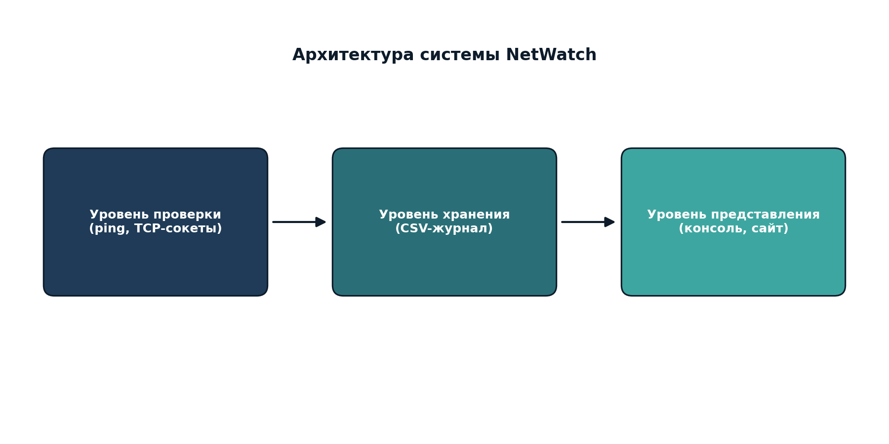

# Технический туториал: создание системы мониторинга NetWatch с нуля

## Введение

Данный туториал описывает пошаговое создание прототипа системы мониторинга сетевых ресурсов NetWatch на языке Python. Система проверяет доступность узлов по протоколу ICMP (ping) и доступность отдельных TCP-портов, после чего сохраняет результаты в журнал в формате CSV.

## Архитектура системы

Система состоит из трёх логических уровней:

1. **Уровень проверки** — модуль, выполняющий ping-проверку и проверку TCP-портов.
2. **Уровень хранения** — запись результатов проверок в CSV-файл журнала.
3. **Уровень представления** — вывод результатов в консоль, а также отображение через статический сайт проекта.



## Шаг 1. Постановка задачи

Перед реализацией необходимо определить:

- список проверяемых узлов (IP-адреса или доменные имена);
- перечень портов, которые нужно проверять для каждого узла;
- формат хранения результатов;
- частоту проверок (в базовой версии — однократный запуск по требованию).

## Шаг 2. Проверка доступности узла (ping)

Для проверки доступности узла используется системная утилита `ping`, вызываемая через модуль `subprocess`. Так как синтаксис команды отличается между Windows и Unix-системами, необходимо определить операционную систему с помощью модуля `platform`.

```python
import platform
import subprocess

def ping_host(host: str) -> tuple[bool, str]:
    system = platform.system().lower()

    if system == "windows":
        command = ["ping", "-n", "1", "-w", "2000", host]
    else:
        command = ["ping", "-c", "1", "-W", "2", host]

    try:
        result = subprocess.run(
            command,
            capture_output=True,
            text=True,
            timeout=5
        )
        return result.returncode == 0, "Доступен" if result.returncode == 0 else "Недоступен"
    except subprocess.TimeoutExpired:
        return False, "Превышено время ожидания"
    except OSError as error:
        return False, f"Ошибка запуска ping: {error}"
```

Ключевой момент: код возврата (`returncode`) равен нулю, если узел ответил на ICMP-запрос.

## Шаг 3. Проверка доступности TCP-порта

Для проверки TCP-порта используется модуль `socket`. Программа пытается установить соединение с указанным портом за ограниченное время.

```python
import socket

def check_port(host: str, port: int, timeout: float = 2.0) -> tuple[bool, str]:
    try:
        with socket.create_connection((host, port), timeout=timeout):
            return True, "Открыт"
    except socket.timeout:
        return False, "Тайм-аут"
    except socket.gaierror:
        return False, "Ошибка DNS"
    except ConnectionRefusedError:
        return False, "Закрыт"
    except OSError:
        return False, "Недоступен"
```

Важное отличие от ping: TCP-проверка подтверждает, что конкретный сервис (например, веб-сервер на порту 443) реально принимает соединения, тогда как ICMP-проверка лишь показывает наличие ответа сетевого узла на ping-запрос.

## Шаг 4. Сохранение результатов в журнал

Результаты каждой проверки записываются построчно в CSV-файл с помощью модуля `csv`.

```python
import csv
from pathlib import Path

LOG_FILE = Path("monitoring_log.csv")

def write_log(rows: list[dict]) -> None:
    file_exists = LOG_FILE.exists()

    with LOG_FILE.open("a", newline="", encoding="utf-8") as file:
        writer = csv.DictWriter(
            file,
            fieldnames=[
                "date_time",
                "target_name",
                "host",
                "check_type",
                "port",
                "status",
                "details"
            ]
        )

        if not file_exists:
            writer.writeheader()

        writer.writerows(rows)
```

## Шаг 5. Основной сценарий проверки

Основная функция `monitor()` перебирает список целей, выполняет для каждой ping-проверку и проверку заданных портов, выводит результат в консоль и сохраняет его в журнал.

```python
from datetime import datetime

TARGETS = [
    {"name": "Google DNS", "host": "8.8.8.8", "ports": [53, 443]},
    {"name": "Cloudflare DNS", "host": "1.1.1.1", "ports": [53, 443]},
    {"name": "GitVerse", "host": "gitverse.ru", "ports": [80, 443]}
]

def monitor() -> None:
    log_rows = []
    check_time = datetime.now().strftime("%Y-%m-%d %H:%M:%S")

    print(f"NetWatch — мониторинг сетевых ресурсов")
    print(f"Время запуска: {check_time}")

    for target in TARGETS:
        name, host = target["name"], target["host"]
        print(f"\nУзел: {name} ({host})")

        ping_status, ping_details = ping_host(host)
        print(f"  Ping: {ping_details}")
        log_rows.append({
            "date_time": check_time, "target_name": name, "host": host,
            "check_type": "PING", "port": "-",
            "status": "OK" if ping_status else "FAIL", "details": ping_details
        })

        for port in target["ports"]:
            port_status, port_details = check_port(host, port)
            print(f"  TCP/{port}: {port_details}")
            log_rows.append({
                "date_time": check_time, "target_name": name, "host": host,
                "check_type": "TCP", "port": port,
                "status": "OK" if port_status else "FAIL", "details": port_details
            })

    write_log(log_rows)
    print("\nРезультаты сохранены в monitoring_log.csv")

if __name__ == "__main__":
    monitor()
```

## Шаг 6. Тестирование программы

Полный код запускается командой:

```bash
cd src
python main.py
```

Пример ожидаемого консольного вывода:

```text
NetWatch — мониторинг сетевых ресурсов
Время запуска: 2026-09-08 14:20:00

Узел: Google DNS (8.8.8.8)
  Ping: Доступен
  TCP/53: Открыт
  TCP/443: Открыт

Узел: Cloudflare DNS (1.1.1.1)
  Ping: Доступен
  TCP/53: Открыт
  TCP/443: Открыт

Результаты сохранены в monitoring_log.csv
```

После запуска в директории `src/` появляется файл `monitoring_log.csv`, содержащий построчную историю всех выполненных проверок.

## Модификация: улучшения сверх базовой реализации

В рамках творческой части в проект были добавлены следующие улучшения:

- **Гибкий список целей.** Список проверяемых узлов и портов вынесен в отдельную структуру данных, что позволяет легко добавлять новые узлы без изменения основной логики программы.
- **Раздельная диагностика ошибок.** Обработка исключений разделена по типам (тайм-аут, ошибка DNS, отказ в соединении), что даёт более точную диагностику причины недоступности узла или порта.
- **Накопительный журнал.** Файл журнала не перезаписывается при каждом запуске, а дополняется новыми записями, что позволяет анализировать историю изменений доступности узла во времени.
- **Кроссплатформенность.** Программа автоматически определяет операционную систему и подбирает корректный синтаксис команды ping для Windows и Unix-подобных систем.

### Возможные направления дальнейшего развития

- Добавление визуализации результатов на веб-странице сайта проекта (например, простая таблица последних проверок).
- Добавление уведомлений (email, Telegram-бот) при обнаружении недоступности критичного узла.
- Реализация периодического запуска проверок по расписанию (например, через `cron` или планировщик заданий Windows).
- Хранение результатов в базе данных SQLite вместо CSV-файла для более удобного анализа.

## Заключение

Реализованный прототип NetWatch демонстрирует базовые принципы построения систем мониторинга сетевой инфраструктуры: проверку доступности на уровне ICMP, проверку доступности на уровне TCP-портов и сохранение истории проверок. Такой подход используется в промышленных системах мониторинга (например, Zabbix, Nagios, Prometheus) в существенно более сложной и масштабируемой форме.
